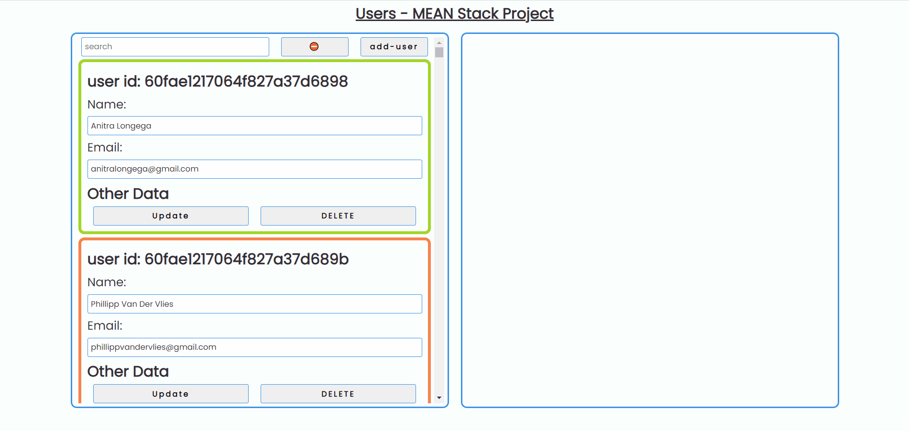

# Users - Angular web application
## Summary ☀️
**MEAN stack web app** that displays users with their data. users have todos & posts. each user can add todos & posts, also mark a todo as completed. if all the user's todos are completed, the user's border becomes green. the app also has a search option.
In addition, I'v used RxJS Subjects for state managment.

this is **FullStack** project that uses the technologies:
* Node.js - Backend
* EXPRESS - Server
* Angular - Frontend (Client)
* MongoDB - Database

#### In Particular: 
* RxJS Subjects & Behavior Subjects
* MongoDB With sub-schemas and sub-documents
* NodeJS & Express server with middleware architecture

## Start this project in your own machine 🤖:
1. clone this project and cd to cloned dir.  
```
git clone git@github.com:nirkopler/UsersWebAppProject.git
```
2. cd to server and start server in your machine. 
``` 
cd server && npm start
```
3. cd to client and start client in your machine.  
```
cd client && npm start
```
4. go to http://localhost:4200/ 😁



## Progress 💪
### 1/8/2021 - Final Touches ✨
* added alerts on Update & Delete User
* fix search input bug
* improved UI (buttons)

### 23/7/2021
* upgraded form validation (email)
* updated app style

### 22/7/2021
* fixed delete bug
* updated app description

### 20/7/2021 - Project is DONE!
* completed add-user comp
* created search bar in users-main 😉
* fixed css of users-main (overflow)
* completed posts section 🎆😁
* created posts section & add-post
* fixed add todo bug
* added postsBL & postsRouter for managing posts PUT & POST requests 👌

### 19/7/2021 - updated server & BIG UI upgrade!
* added selected user background change
* completed todos section 🎆😁
* updated app with new userUtils Service🥰
* applyed BehaviorSubject in userUtils Service (for state managment)
* added todosBL & todosRouter for managing todos PUT & POST requests 👌

### 17/7/2021
* create base services for todos & posts BL 
* created todos section
* created basic dashboard functionality
* added users-main parent-child binding
* fixed server userModel 🚀
* added border color for todos

### 16/7/2021 - main client setup
* basic client routing
* client users-main & user components
* created userUtils Service ⛽
* created :User Interface in client (user.ts) 👍
* client basic style
* client basic setup
* created client dir

### 15/7/2021 - server setup 👌 ⛽
* server error handling
* specific model schema and subschema 👍
* basic server setup 
* created server architecture
* created all files for EXPRESS server

### 14/7/2021 - architectural plan
* created DB architecture
* created Client architecture

## Things to do 🔥
* Nothing (for now 😄)